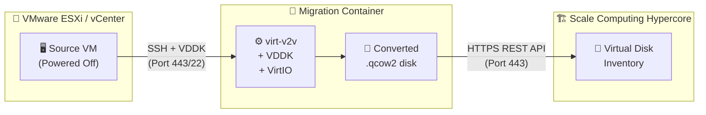

# 🔄 ESX to Scale Computing Hypercore Migration Tool

> Automated migration tool to convert and upload VMware ESXi/vCenter VMs to Scale Computing Hypercore clusters — packaged as a single Docker container.

> [!CAUTION]
> **THIS IS PROVIDED AS-IS WITH NO WARRANTY. USE AT YOUR OWN RISK.**

---

## 📸 Screenshots

| Prerequisites Check | VMware Connection | Migration in Progress |
|:---:|:---:|:---:|
|  |  |  |

---

## ✨ Features

| | Feature | Description |
|---|---|---|
| 🌐 | **Web UI** | Modern React-based interface for managing migrations |
| 🐳 | **Docker Container** | All dependencies pre-installed, zero host setup |
| ⚡ | **VDDK Support** | High-performance direct disk access to VMware |
| 🪟 | **VirtIO Injection** | Windows VMs boot properly on Scale |
| 📡 | **Real-time Progress** | WebSocket-based live progress tracking |
| ⏸️ | **Stop / Start / Resume** | Pause and resume migrations |
| 🔀 | **Concurrent Migrations** | Run multiple VM migrations in parallel |
| 💾 | **Flexible Storage** | Local, NFS, or SMB mount options |
| 🔌 | **Connection Manager** | Save and reuse VMware/Scale connections |
| 🖥️ | **CLI Mode** | Legacy bash script available for bare-metal use |

---

## 📋 Prerequisites

### 🖥️ Host Machine

| Requirement | Minimum | Recommended |
|---|---|---|
| **OS** | Ubuntu 24.04 LTS | Ubuntu 24.04 LTS |
| **CPU** | x86_64 with VT-x / AMD-V | 4+ cores |
| **RAM** | 8 GB | 16 GB+ |
| **Storage** | 2x total VM size | NVMe/SSD |
| **Network** | 1 Gbps | 10 GbE |

### 🛠️ Software

- **Docker Engine** 24.0+ with Docker Compose v2
- **KVM** — `/dev/kvm` must be accessible
- **Git** — for cloning the repository

### 🌐 Network Access

| Target | Ports | Direction |
|---|---|---|
| ESXi / vCenter | 443 (HTTPS), 22 (SSH) | Outbound from container |
| Scale Computing Hypercore | 443 (HTTPS) | Outbound from container |
| Internet (build only) | 443 | For Docker image build |

### 📦 VMware VDDK

Download the **VMware Virtual Disk Development Kit (VDDK) 8.x** tarball from the [VMware Developer Portal](https://developer.broadcom.com/sdks/vmware-virtual-disk-development-kit-vddk/latest). You'll upload it through the web UI after deployment.

---

## 🚀 Quick Start

### 1. Install Docker

```bash
# Install Docker on Ubuntu 24.04
curl -fsSL https://get.docker.com | sudo sh
sudo usermod -aG docker $USER
newgrp docker
```

### 2. Verify KVM

```bash
# Check KVM support
sudo apt install -y cpu-checker
kvm-ok

# Ensure /dev/kvm exists and is accessible
ls -la /dev/kvm
```

> [!NOTE]
> If running Ubuntu inside a KVM virtual machine, **nested virtualization** must be enabled on the hypervisor. See [KVM Host Configuration](#-kvm-host-configuration) below.

### 3. Clone & Configure

```bash
git clone https://github.com/mjlyon/ESX-to-Scale-Migration.git
cd ESX-to-Scale-Migration
cp .env.example .env
```

Edit `.env` if you need to change the port, timezone, or resource limits:

```bash
nano .env
```

### 4. Build & Launch

```bash
docker compose up -d
```

### 5. Open the Web UI

Navigate to **http://\<host-ip\>:8080** in your browser.

### 6. Complete Setup

1. Go to **Setup** and upload your VMware VDDK tarball
2. Configure **Storage** (local volume, NFS, or SMB)
3. Add **Connections** for your VMware and Scale Computing environments
4. Start a **New Migration** from the dashboard

---

## 🔧 KVM Host Configuration

### Verify KVM Support

```bash
# Should output: INFO: /dev/kvm exists - KVM acceleration can be used
kvm-ok

# Check kernel modules
lsmod | grep kvm
```

### Nested Virtualization (if host is a VM)

If your Ubuntu 24.04 host is itself running as a KVM virtual machine, the **outer hypervisor** must enable nested virtualization:

```bash
# On the OUTER KVM host (Intel):
sudo modprobe -r kvm_intel
sudo modprobe kvm_intel nested=1

# Make persistent:
echo "options kvm_intel nested=1" | sudo tee /etc/modprobe.d/kvm-nested.conf

# For AMD:
sudo modprobe -r kvm_amd
sudo modprobe kvm_amd nested=1
echo "options kvm_amd nested=1" | sudo tee /etc/modprobe.d/kvm-nested.conf
```

Verify inside the Ubuntu VM:

```bash
cat /sys/module/kvm_intel/parameters/nested   # Should output: Y
# or
cat /sys/module/kvm_amd/parameters/nested     # Should output: 1
```

### `/dev/kvm` Permissions

```bash
# Ensure your user can access KVM
sudo usermod -aG kvm $USER
ls -la /dev/kvm
# crw-rw---- 1 root kvm 10, 232 ... /dev/kvm
```

### AppArmor

Ubuntu uses AppArmor by default. The `docker-compose.yml` includes `security_opt: apparmor:unconfined` for the container. No host-level AppArmor changes are needed.

---

## ⚙️ Configuration Reference

### Environment Variables

| Variable | Default | Description |
|---|---|---|
| `ESX2SCALE_PORT` | `8080` | Web UI port on the host |
| `MAX_CONCURRENT_JOBS` | `2` | Parallel migration jobs |
| `TZ` | `America/New_York` | Timezone for logs and UI |
| `MEMORY_LIMIT` | `8g` | Container memory limit |
| `ESX2SCALE_DB_PATH` | `/data/db/esx2scale.db` | SQLite database path |
| `ESX2SCALE_CONVERSION_DIR` | `/data/conversions` | Temp conversion storage |
| `ESX2SCALE_VDDK_DIR` | `/data/vddk` | VDDK library location |
| `ESX2SCALE_LOG_DIR` | `/data/logs` | Application logs |

### Storage Options

All conversion data lives under `/data` inside the container, backed by a Docker named volume by default.

<details>
<summary><b>📂 Local Storage (Default)</b></summary>

Uses a Docker named volume. Good for small migrations or testing.

```yaml
volumes:
  - esx2scale-data:/data
```

</details>

<details>
<summary><b>💽 Bind Mount (Recommended for Production)</b></summary>

Mount fast local NVMe/SSD storage directly. Best performance for large migrations.

```yaml
volumes:
  - esx2scale-data:/data
  - /opt/esx2scale/conversions:/data/conversions
```

Use XFS filesystem for best large-file performance:

```bash
sudo mkfs.xfs /dev/nvme0n1p1
sudo mkdir -p /opt/esx2scale/conversions
sudo mount /dev/nvme0n1p1 /opt/esx2scale/conversions
```

</details>

<details>
<summary><b>🌐 NFS Storage</b></summary>

Mount NFS on the host, then bind-mount into the container:

```bash
# On the host
sudo apt install -y nfs-common
sudo mkdir -p /mnt/nfs-conversions
sudo mount -t nfs your-nas:/export/conversions /mnt/nfs-conversions
```

```yaml
# docker-compose.yml
volumes:
  - esx2scale-data:/data
  - /mnt/nfs-conversions:/data/conversions
```

Or configure NFS mounts through the web UI under **Storage**.

</details>

<details>
<summary><b>🔗 SMB/CIFS Storage</b></summary>

Mount SMB on the host, then bind-mount into the container:

```bash
# On the host
sudo apt install -y cifs-utils
sudo mkdir -p /mnt/smb-conversions
sudo mount -t cifs //server/share /mnt/smb-conversions -o username=user,password=pass
```

```yaml
# docker-compose.yml
volumes:
  - esx2scale-data:/data
  - /mnt/smb-conversions:/data/conversions
```

Or configure SMB mounts through the web UI under **Storage**.

</details>

---

## 🔄 Migration Workflow



### How It Works

| Phase | Description |
|---|---|
| 🔌 **Connect** | Connects to ESXi/vCenter via libvirt, retrieves VM inventory and moref IDs |
| ⚙️ **Convert** | Uses virt-v2v with VDDK for fast disk access, injects VirtIO drivers for Windows |
| 🔄 **Post-Process** | Converts raw disks to qcow2 format (`compat=0.10`) for Scale compatibility |
| ☁️ **Upload** | Uploads qcow2 disk(s) to Scale via REST API with progress tracking |
| ✅ **Finalize** | Disk appears in Scale Hypercore virtual disk inventory, ready to attach |

---

## ✅ Supported VM Types

### Operating Systems

| | OS | Versions |
|---|---|---|
| 🪟 | Windows | 7, 8, 10, 11, Server 2008 R2 – 2022 |
| 🐧 | Linux | Ubuntu, Debian, CentOS, RHEL, Fedora, SUSE |
| 💻 | Other | Most modern x86_64 operating systems |

### Disk Types

| Supported | Not Supported |
|---|---|
| ✅ VMDK (all variants) | ❌ VMs with snapshots (delete first) |
| ✅ Thin provisioned | ❌ RDM (raw device mapping) disks |
| ✅ Thick provisioned | ❌ Physical device passthrough |
| ✅ Multiple disks per VM | ❌ Powered-on VMs (must be shut down) |

---

## 🐛 Troubleshooting

<details>
<summary><b>🐳 Container won't start</b></summary>

**`/dev/kvm: no such file or directory`**

KVM is not available on the host. Check:
```bash
kvm-ok
ls -la /dev/kvm
```

If running inside a VM, enable nested virtualization (see [KVM Host Configuration](#-kvm-host-configuration)).

**Permission denied on `/dev/kvm`**

```bash
sudo usermod -aG kvm $USER
# Log out and back in, then retry
```

**AppArmor blocking container operations**

The compose file includes `apparmor:unconfined`. If you still see AppArmor denials:
```bash
# Check AppArmor status
sudo aa-status

# As a last resort, use privileged mode instead:
# Uncomment `privileged: true` in docker-compose.yml
# and remove the devices/cap_add/security_opt lines
```

</details>

<details>
<summary><b>⚙️ virt-v2v conversion fails</b></summary>

**`supermin: kernel not found`**

The container couldn't find a kernel for libguestfs. Check entrypoint logs:
```bash
docker compose logs esx2scale | grep -i kernel
```

The container auto-detects the kernel from `/boot/vmlinuz-*`. If missing, the Docker image may need rebuilding:
```bash
docker compose build --no-cache
```

**`VixDiskLib_Open: Unknown error`**

- Verify VDDK was uploaded correctly in the **Setup** page
- Ensure the source VM is **powered off**
- Check ESXi is accessible on port 443

**Failed to retrieve VM moref**

- Ensure SSH is enabled on the ESXi host
- Test connectivity: `ssh root@esxi-host vim-cmd vmsvc/getallvms`

</details>

<details>
<summary><b>☁️ Upload to Scale fails</b></summary>

**Connection refused**

- Verify Scale Hypercore API is accessible:
  ```bash
  curl -k https://scale-cluster/rest/v1/
  ```
- Check firewall rules allow port 443 outbound

**Timeout during upload**

- Large disks on slow networks may timeout
- Consider using a bind mount with local NVMe for faster conversion
- Check `MAX_CONCURRENT_JOBS` — uploading multiple VMs saturates bandwidth

</details>

<details>
<summary><b>🐌 Performance issues</b></summary>

| Tip | Impact |
|---|---|
| Use local NVMe/SSD for `/data/conversions` | 50%+ faster conversions |
| Use XFS filesystem for large files | Better than ext4 for VM images |
| Enable 10GbE / jumbo frames (MTU 9000) | Faster upload to Scale |
| Place migration host close to Scale cluster | Reduces network latency |
| Tune `MAX_CONCURRENT_JOBS` | Balance parallelism vs. I/O saturation |
| Increase `MEMORY_LIMIT` for large VMs | Prevents OOM during conversion |

</details>

---

## 🔄 Upgrading

```bash
cd ESX-to-Scale-Migration
git pull
docker compose build
docker compose up -d
```

Your data (database, connections, VDDK) is stored in the `esx2scale-data` volume and persists across upgrades.

---

## 🧑‍💻 Development Mode

For local development with hot-reload on the backend:

```bash
docker compose -f docker-compose.dev.yml up
```

This mounts `./backend` into the container and runs Uvicorn with `--reload`, so code changes take effect immediately.

For frontend development, run the Vite dev server separately:

```bash
cd frontend
npm install
npm run dev
```

The Vite server at `http://localhost:5173` proxies API calls to the backend at `:8080`.

---

## 🏁 Post-Migration Steps

1. **Verify disk in Scale Hypercore**
   - Log into Scale web interface
   - Navigate to Storage → Virtual Disks
   - Confirm uploaded disk appears

2. **Create new VM in Scale**
   - Create VM with appropriate CPU/RAM
   - Attach uploaded virtual disk
   - Use VIRTIO for disk and network controllers

3. **Boot and test**
   - Power on VM
   - Verify successful boot
   - Test network connectivity
   - Validate applications

4. **Clean up**
   - Remove local converted files if no longer needed
   - Update Scale VM settings as needed

---

## 🔒 Security Notes

> [!WARNING]
> VMware and Scale TLS verification is disabled by default because self-signed certificates are common in these environments. Enable verification if using CA-signed certs.

- **Credentials** are never logged or stored in plaintext — passwords are held in memory only
- **Container privileges**: Uses explicit KVM device passthrough and targeted capabilities instead of full `--privileged` mode
- **AppArmor**: Container runs with `apparmor:unconfined` to allow virtualization operations
- **Network**: All VMware/Scale communication uses HTTPS (port 443)

---

## 📄 Additional Documentation

- **[Ubuntu Bare-Metal Guide](README-Ubuntu.md)** — Install without Docker on Ubuntu/Debian
- **[RedHat Bare-Metal Guide](README-RedHat.md)** — Install without Docker on RHEL/Alma/Rocky/Fedora

---

## 📜 License

GPL-3.0 License — See [LICENSE](LICENSE) file for details.

## 🙏 Acknowledgments

- Built on [**virt-v2v**](https://libguestfs.org/) from the libguestfs project
- Uses **VMware VDDK** for optimal disk access performance
- [**VirtIO drivers**](https://fedorapeople.org/groups/virt/virtio-win/) from the Fedora Project

## 📞 Support

- **GitHub**: https://github.com/mjlyon/ESX-to-Scale-Migration
- **Scale Computing**: https://www.scalecomputing.com/resources
- **virt-v2v Docs**: https://libguestfs.org/virt-v2v.1.html

---

**Project Version**: 2.0 (Ubuntu Container Edition) &nbsp;|&nbsp; **Maintainer**: mjlyon
